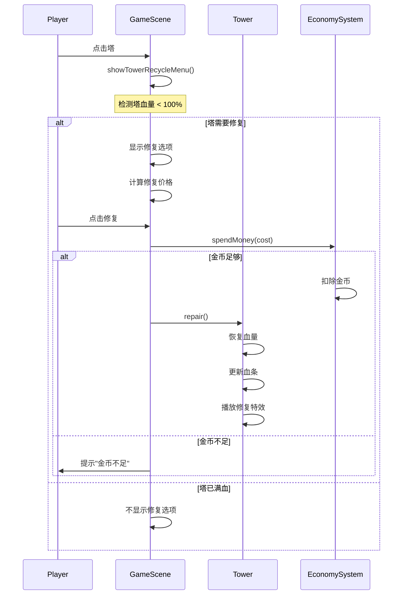

# 塔攻击粒子效果与修复功能设计规格

## 概述

为Farm Defender游戏的最后一关（Level 6+）添加塔被动物攻击的视觉反馈和塔修复功能。

**核心需求：**
1. 动物攻击塔时显示攻击粒子效果
2. 塔被攻击时自动显示血条
3. 塔可以通过花费金钱进行修复

## 功能设计

### 1. 动物攻击粒子效果

**粒子类型：** 爪击粒子（claw particles）

**触发时机：**
- `TowerBreakerBehavior` 在攻击范围内发射攻击粒子
- 每次攻击间隔（`attackCooldownMs`）发射一组粒子

**视觉表现：**
- 粒子从敌人位置飞向塔的位置
- 粒子带有轻微旋转和缩放动画
- 击中塔时消失，触发塔的受伤效果

**技术参数：**
```typescript
{
  particleCount: 5,           // 每次攻击发射粒子数量
  particleSpeed: 200,         // 粒子飞行速度 (px/s)
  particleLifespan: 500,      // 粒子生命周期 (ms)
  particleSize: 8,            // 粒子大小 (px)
  particleColor: 0xFFAA00,    // 粒子颜色（橙黄色，类似爪击）
  particleRotation: true,     // 粒子旋转
  particleScale: { start: 1, end: 0.5 }  // 缩放动画
}
```

**实现方式：**
- 使用 Phaser 粒子系统
- 在 `TowerBreakerBehavior.update()` 攻击时创建粒子发射器
- 粒子目标位置为塔的坐标

### 2. 塔受伤粒子效果

**粒子类型：** 碎片粒子（debris particles）

**触发时机：**
- `Tower.takeDamage()` 方法被调用时
- 每次受伤触发一次粒子爆发

**视觉表现：**
- 粒子在塔周围随机位置生成
- 向上飞散，带有重力下落效果
- 逐渐消失（alpha 渐变）

**技术参数：**
```typescript
{
  particleCount: 10,          // 每次受伤爆发粒子数量
  particleSpeed: { min: 50, max: 150 },  // 随机速度范围
  particleAngle: { min: 240, max: 300 }, // 发射角度（向上）
  particleLifespan: 600,      // 生命周期 (ms)
  particleSize: 4,            // 粒子大小 (px)
  particleGravity: 200,       // 重力加速度
  particleColor: 0x666666,    // 粒子颜色（灰色，类似碎片）
  spread: 20                  // 围绕塔的分布范围 (px)
}
```

**实现方式：**
- 在 `Tower.takeDamage()` 中创建粒子爆发效果
- 使用 Phaser Tweens 控制粒子运动
- 粒子颜色可根据塔的类型变化（可选）

### 3. 塔血条系统

**血条显示逻辑：**

| 状态 | 血条可见性 | 血条颜色 |
|------|-----------|---------|
| 满血（100%） | 隐藏 | N/A |
| 受伤（>50%） | 显示 | 绿色 (0x00FF00) |
| 受伤（≤50%） | 显示 | 黄色 (0xFFFF00) |
| 重伤（≤25%） | 显示 | 红色 (0xFF0000) |

**血条样式：**
- **位置：** 塔的上方，Y偏移 `-25px`
- **尺寸：** 宽度 40px，高度 6px
- **组成：**
  - 背景：黑色矩形 (`healthBarBg`)
  - 前景：动态宽度矩形 (`healthBar`)，表示当前血量百分比

**初始化时机：**
- 在 `Tower` 构造函数中创建血条对象
- 初始状态为隐藏（`visible: false`）

**更新逻辑：**
```typescript
// 伪代码
takeDamage(amount) {
  currentHealth -= amount
  updateHealthBar()
}

updateHealthBar() {
  if (currentHealth === maxHealth) {
    healthBar.visible = false
    return
  }

  healthBar.visible = true
  const percentage = currentHealth / maxHealth
  const barWidth = 40 * percentage

  healthBar.width = barWidth

  // 根据血量设置颜色
  if (percentage > 0.5) {
    healthBar.fillColor = 0x00FF00  // 绿色
  } else if (percentage > 0.25) {
    healthBar.fillColor = 0xFFFF00  // 黄色
  } else {
    healthBar.fillColor = 0xFF0000  // 红色
  }
}
```

### 4. 塔修复功能

**修复流程：**



**修复价格计算公式：**

```typescript
修复价格 = (最大血量 - 当前血量) × 单位修复价格

单位修复价格 = 塔原始成本 × 修复成本比例

修复成本比例 = 0.5  // 可配置
```

**示例计算：**
```
塔原始成本 = 100金币
最大血量 = 100 HP
当前血量 = 40 HP

缺失血量 = 100 - 40 = 60 HP
单位修复价格 = 100 × 0.5 = 0.5 金币/HP
修复价格 = 60 × 0.5 = 30 金币
```

**修复特效：**

- **粒子类型：** 修复粒子（repair particles）
- **视觉表现：** 绿色/金色粒子从塔底部向上飞散
- **参数：**
  ```typescript
  {
    particleCount: 15,
    particleSpeed: { min: 80, max: 120 },
    particleAngle: { min: 250, max: 290 },  // 向上
    particleLifespan: 800,
    particleSize: 6,
    particleColor: 0x00FF00,  // 绿色（或 0xFFD700 金色）
    particleGravity: -50      // 反重力，向上飘
  }
  ```

**修复方法签名：**

```typescript
class Tower {
  /**
   * 修复塔，恢复指定血量
   * @param amount 恢复的血量，默认恢复到满血
   */
  public repair(amount?: number): void {
    if (this.destroyed) return;

    const maxHeal = this.maxHealth - this.currentHealth;
    const healAmount = amount ?? maxHeal;

    this.currentHealth = Math.min(
      this.maxHealth,
      this.currentHealth + healAmount
    );

    this.updateHealthBar();

    // 播放修复特效
    this.playRepairEffect();
  }

  /**
   * 计算修复到满血所需价格
   */
  public getRepairCost(): number {
    const missingHealth = this.maxHealth - this.currentHealth;
    const unitRepairCost = this.originalCost * 0.5;
    return Math.floor(missingHealth * unitRepairCost / this.maxHealth);
  }
}
```

## 数据流设计

### 攻击粒子数据流

```
TowerBreakerBehavior.update()
  ↓
检测攻击时机 (time - lastAttackTime >= attackCooldownMs)
  ↓
发射攻击粒子 (ParticleFactory.createAttackParticles())
  ↓
Tower.takeDamage(attackDamage)
  ↓
触发受伤粒子 (ParticleFactory.createDamageParticles())
  ↓
更新血条 (Tower.updateHealthBar())
```

### 修复数据流

```
玩家点击塔
  ↓
GameScene.showTowerRecycleMenu(tower)
  ↓
检测塔血量 (tower.getCurrentHealth() < tower.getMaxHealth())
  ↓
显示修复选项 + 计算修复价格 (tower.getRepairCost())
  ↓
玩家点击修复
  ↓
检查金币 (economySystem.getMoney() >= repairCost)
  ↓
扣除金币 (economySystem.spendMoney(repairCost))
  ↓
Tower.repair()
  ↓
播放修复特效 (ParticleFactory.createRepairParticles())
```

## 错误处理

### 边界情况

| 情况 | 处理方式 |
|------|---------|
| 塔已满血时点击修复 | 菜单不显示修复选项，或显示灰色禁用状态 |
| 金钱不足时点击修复 | 提示"金币不足"，不执行修复操作 |
| 塔已被摧毁时 | 不响应任何操作（通过 `active` 和 `isDestroyed()` 检查） |
| 动物攻击已死亡的塔 | `TowerBreakerBehavior` 在寻找目标时过滤 `active && !isDestroyed()` |
| 修复过程中塔被摧毁 | 修复操作会被 `isDestroyed()` 检查拦截，不会执行 |

### 性能优化

1. **粒子对象池：**
   - 使用 Phaser 内置粒子池机制
   - 避免频繁创建/销毁粒子对象
   - 粒子生命周期结束后自动回收到池中

2. **血条渲染优化：**
   - 血条隐藏时（`visible: false`）不参与渲染
   - 只在血量变化时更新血条，避免每帧更新

3. **修复特效优化：**
   - 使用一次性 Tweens，自动清理
   - 不创建持久化的粒子系统

## 配置参数

新增配置常量（建议添加到 `src/config/constants.ts`）：

```typescript
export const TOWER_REPAIR_CONFIG = {
  // 修复成本比例：修复价格 = 缺失血量 × 塔原始成本 × 此比例
  repairCostRatio: 0.5,

  // 血条样式
  healthBarWidth: 40,
  healthBarHeight: 6,
  healthBarOffsetY: -25,  // 相对于塔的Y偏移

  // 攻击粒子参数
  attackParticle: {
    count: 5,
    speed: 200,
    lifespan: 500,
    size: 8,
    color: 0xFFAA00,
  },

  // 受伤粒子参数
  damageParticle: {
    count: 10,
    speedMin: 50,
    speedMax: 150,
    lifespan: 600,
    size: 4,
    gravity: 200,
    color: 0x666666,
    spread: 20,
  },

  // 修复粒子参数
  repairParticle: {
    count: 15,
    speedMin: 80,
    speedMax: 120,
    lifespan: 800,
    size: 6,
    color: 0x00FF00,  // 或 0xFFD700 金色
    gravity: -50,      // 反重力，向上飘
  },
};
```

## 架构影响

### 需要修改的文件

1. **`src/entities/Tower.ts`**
   - 添加血条渲染逻辑（构造函数、`updateHealthBar()`）
   - 添加 `repair()` 方法
   - 添加 `getRepairCost()` 方法
   - 修改 `takeDamage()` 方法，触发受伤粒子和血条更新

2. **`src/entities/behaviors/TowerBreakerBehavior.ts`**
   - 修改 `update()` 方法，在攻击时发射攻击粒子
   - 注入 `ParticleFactory` 或直接在行为中创建粒子

3. **`src/game/GameScene.ts`**
   - 修改 `showTowerRecycleMenu()` 方法，添加修复选项
   - 添加修复按钮点击处理逻辑
   - 集成 `EconomySystem` 进行金币扣除

4. **`src/systems/TowerManager.ts`** （可选）
   - 可添加 `repairTower()` 方法作为中间层（或在 GameScene 直接处理）

### 新增文件

1. **`src/utils/ParticleFactory.ts`**
   - 粒子效果工厂类
   - 提供静态方法创建攻击/受伤/修复粒子
   - 方法签名：
     ```typescript
     export class ParticleFactory {
       static createAttackParticles(
         scene: Phaser.Scene,
         fromX: number, fromY: number,
         toX: number, toY: number
       ): void;

       static createDamageParticles(
         scene: Phaser.Scene,
         x: number, y: number,
         color?: number
       ): void;

       static createRepairParticles(
         scene: Phaser.Scene,
         x: number, y: number
       ): void;
     }
     ```

2. **`src/config/constants.ts`** （修改）
   - 添加 `TOWER_REPAIR_CONFIG` 常量

## 测试计划

### 单元测试

1. **Tower 血条测试**
   - 测试血条在不同血量下的显示/隐藏状态
   - 测试血条颜色随血量变化
   - 测试 `repair()` 方法正确恢复血量
   - 测试 `getRepairCost()` 计算正确

2. **粒子效果测试**
   - 测试粒子在正确时机创建
   - 测试粒子生命周期正确管理

### 集成测试

1. **攻击粒子流程测试**
   - 验证动物攻击时粒子正确发射
   - 验证塔受伤时粒子正确触发

2. **修复流程测试**
   - 验证修复按钮在塔血量 < 100% 时显示
   - 验证修复扣除正确金币数量
   - 验证塔血量正确恢复
   - 验证金币不足时的错误处理

### 手动测试清单

- [ ] 动物攻击塔时能看到攻击粒子效果
- [ ] 塔受伤时能看到碎片粒子效果
- [ ] 塔受伤时血条自动显示
- [ ] 血条颜色随血量变化（绿→黄→红）
- [ ] 塔满血时血条隐藏
- [ ] 点击塔时回收菜单显示修复选项（血量 < 100%）
- [ ] 点击修复后金币正确扣除
- [ ] 修复后塔血量恢复
- [ ] 修复时播放修复特效
- [ ] 金币不足时提示"金币不足"
- [ ] 塔满血时修复选项隐藏或禁用

## 时间估算

- **粒子效果实现**：2-3小时
  - ParticleFactory 类：1小时
  - 攻击粒子效果：1小时
  - 受伤/修复粒子效果：1小时

- **血条系统**：1-2小时
  - Tower 类修改：1小时
  - 测试和调整：1小时

- **修复功能**：2-3小时
  - GameScene 菜单修改：1.5小时
  - 修复逻辑集成：1小时
  - 错误处理：0.5小时

- **测试和调试**：2-3小时

**总计：** 7-11小时

## 成功标准

1. ✅ 动物攻击塔时有明显的攻击粒子效果
2. ✅ 塔受伤时有碎片粒子效果
3. ✅ 塔受伤时血条自动显示，满血时隐藏
4. ✅ 血条颜色随血量动态变化
5. ✅ 玩家可以通过菜单修复塔
6. ✅ 修复扣除正确金币数量
7. ✅ 修复时播放修复特效
8. ✅ 错误情况（金币不足、塔满血）正确处理
9. ✅ 所有新增代码通过 TypeScript 严格模式检查
10. ✅ 单元测试覆盖核心逻辑（血条、修复计算）

## 未来扩展

可选的后续优化：

1. **修复分级**：支持修复50%、75%、100%等不同档次
2. **塔升级与修复**：修复时可以选择性增强某些属性
3. **自动修复**：提供"自动修复"升级选项
4. **修复动画**：塔修复时播放更丰富的动画（如光圈扩散）
5. **粒子主题**：根据塔类型定制不同的攻击粒子（如冰塔发射冰晶粒子）
